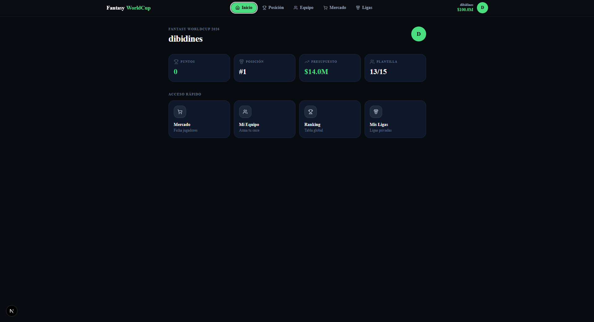
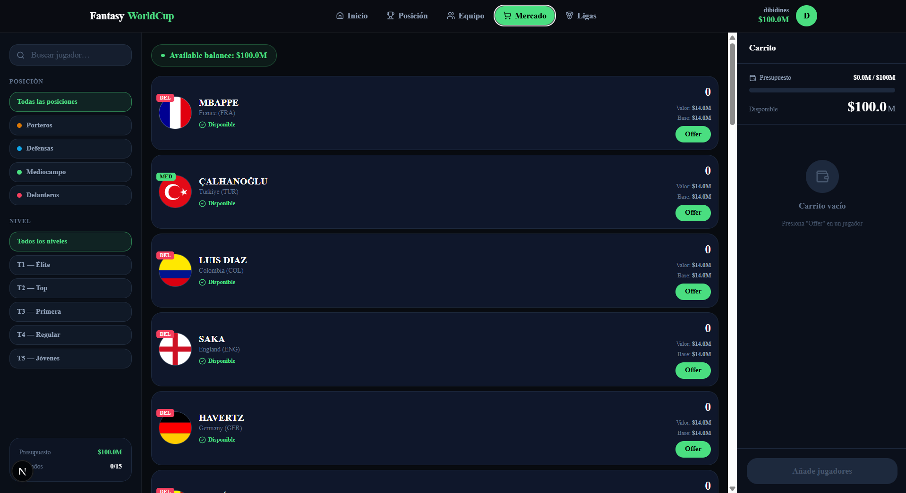
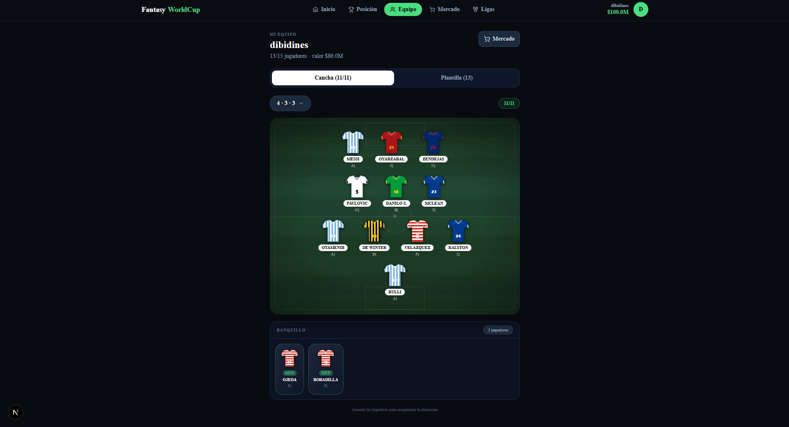
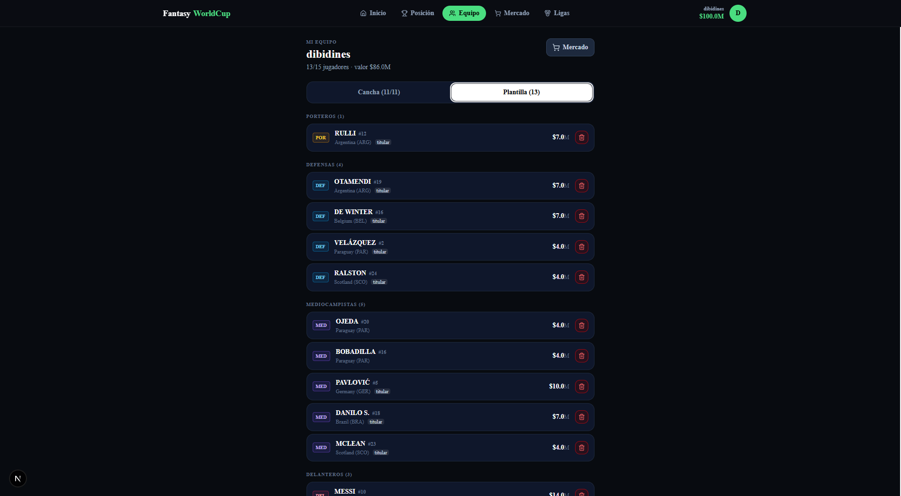
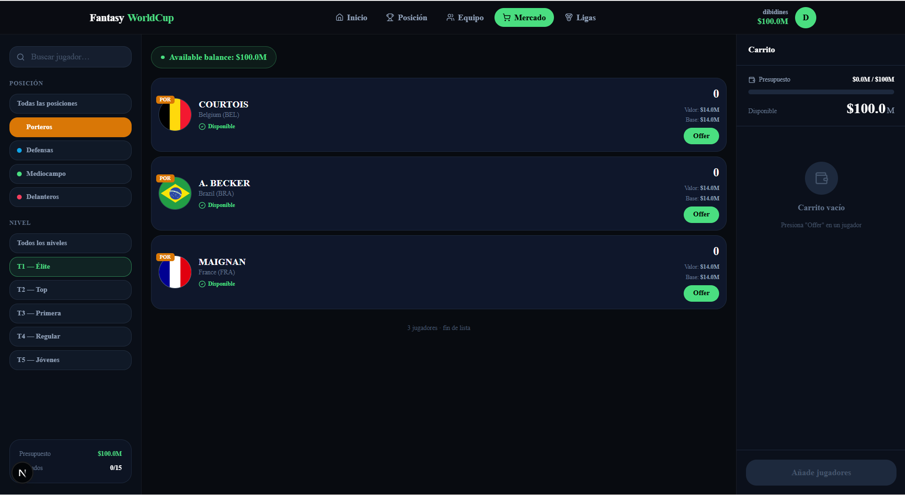
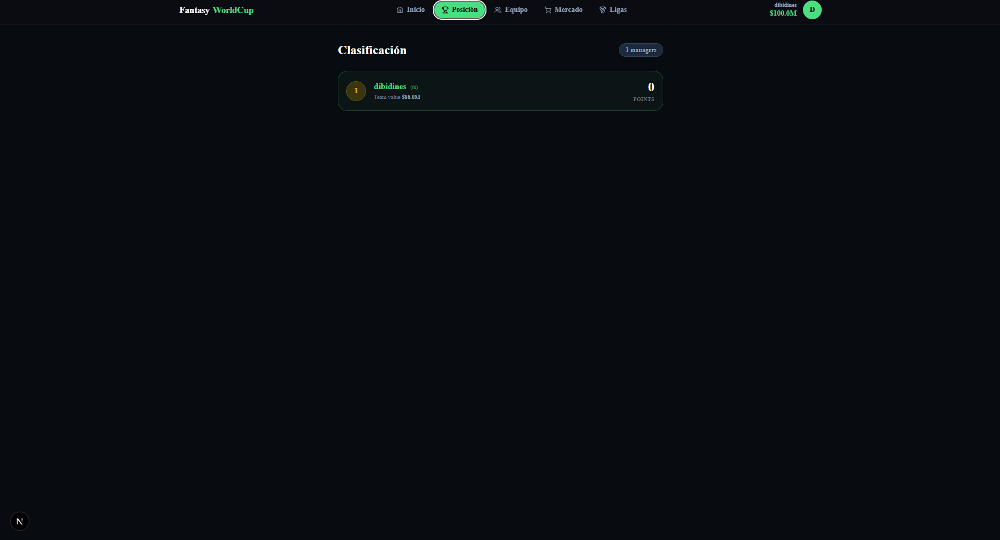

# Fantasy WorldCup 2026

A full-stack fantasy football web app built for the FIFA World Cup 2026. Users manage a squad of 15 players from 48 national teams, set a starting XI, and compete in private leagues — all within a $100M budget.

> Built as a portfolio project to demonstrate end-to-end product engineering: database design, server-side logic, real-time UI, and mobile-first design.

---

## Screenshots

| Dashboard | Mercado |
|---|---|
|  |  |

| Cancha | Plantilla |
|---|---|
|  |  |

| Mercado — filtros | Ranking |
|---|---|
|  |  |

---

## Tech Stack

| Layer | Technology |
|-------|-----------|
| Framework | Next.js 16 (App Router, Server Actions) |
| Database | PostgreSQL via Supabase (RLS, SECURITY DEFINER RPCs) |
| Auth | Supabase Auth |
| Styling | Tailwind CSS v4 |
| Language | TypeScript |
| Realtime | Supabase Realtime (budget updates) |

---

## Features

### Player Market
- 1,248 players across 48 national teams in 5 price tiers ($2M–$14M)
- Budget enforcement ($100M cap) via PostgreSQL RPC with `FOR UPDATE` row lock — race-condition-proof
- Squad composition rules: exactly 2 GK / 5 DEF / 5 MID / 3 FWD, max 3 players per nation
- Real-time budget updates via Supabase Realtime channels

### Team & Formation
- Pitch view with HTML5 drag-and-drop to arrange the starting XI
- 6 formations: 4-3-3 · 4-4-2 · 3-4-3 · 5-3-2 · 4-5-1 · 3-5-2
- National kit SVG renderer with 5 pattern styles (solid, vertical stripes, horizontal stripes, checkerboard, vertical halves) — Argentina gets sky-blue/white stripes, Croatia gets red/white checkers, Portugal gets the green/red split
- National flags via [flagicons](https://flagicons.lipis.dev/) CDN
- Auto-save lineup with debounced Server Action

### Scoring & Economics
- Points engine: goals, assists, clean sheets, cards — position-weighted
- Dynamic pricing: player value rises/falls after each matchday based on points scored
- Price floor at 80% of base value to prevent crashes

### Leagues & Ranking
- Create private leagues with invite codes, or join public ones
- Live global ranking with team value tiebreaker

### Admin Panel
- Process matchdays: register results, trigger scoring, update prices, freeze lineups

### UI / UX
- Dark navy theme with lime-green accents
- Mobile-first: bottom tab bar on mobile, full sidebar on desktop
- Glass-effect navbar with `backdrop-blur`

---

## Database Design Highlights

- **`fichar_jugador` RPC** — SECURITY DEFINER function that validates budget, squad limits, position composition, and national team quota in a single atomic transaction
- **Trigger `trg_check_titulares_max`** — enforces the 11-starter constraint at the database level, not the application layer
- **`actualizar_precios_jornada()`** — price update function with a floor at `precio_base × 0.80` to prevent exploitation
- **Row Level Security** on all user-owned tables; admin operations use a server-side `createAdminClient()` with the service role key after `getUser()` verification

---

## Local Setup

### Prerequisites
- Node.js 20+
- [Supabase CLI](https://supabase.com/docs/guides/cli)
- Docker (for local Supabase)

### Steps

```bash
# 1. Clone
git clone https://github.com/YOUR_USERNAME/fantasy-worldcup-2026
cd fantasy-worldcup-2026

# 2. Install dependencies
npm install

# 3. Copy env and fill in your Supabase credentials
cp .env.example .env.local

# 4. Start local Supabase (runs Postgres + Auth + Storage in Docker)
npx supabase start

# 5. Apply migrations in order
#    Open Supabase Studio at http://localhost:54323
#    and run each file in supabase/migrations/ via the SQL editor

# 6. Start the dev server
npm run dev
```

Open [http://localhost:3000](http://localhost:3000).

---

## Project Structure

```
src/
├── app/
│   ├── (auth)/login/        # Login / signup page
│   ├── (dashboard)/
│   │   ├── dashboard/       # Home stats
│   │   ├── mercado/         # Player market
│   │   ├── mi-equipo/       # Squad & lineup
│   │   ├── ranking/         # Global leaderboard
│   │   └── ligas/           # Leagues
│   ├── admin/               # Admin matchday panel
│   └── onboarding/          # First-time team name setup
├── components/
│   ├── Cancha.tsx           # Pitch with drag-and-drop
│   ├── NationalKitIcon.tsx  # SVG kit renderer (5 patterns, 48 teams)
│   ├── Navbar.tsx           # Top nav + mobile bottom tab bar
│   └── mercado/
│       └── MercadoClient.tsx
└── types/
    └── database.types.ts

supabase/migrations/         # 17 ordered SQL migrations
```

---

## Migrations Overview

| File | Description |
|------|-------------|
| `001` | Base schema (players, teams, squads, leagues) |
| `004` | `fichar_jugador` RPC — buy player with full validation |
| `005` | Dynamic pricing tiers and price update function |
| `008–009` | Match registration and scoring engine |
| `011` | Squad limit fix (15 players) |
| `014` | Price rebalance: T1=$14M → T5=$2M |
| `015` | Position composition validation in RPC |
| `016` | Titular trigger + `validar_alineacion_completa` RPC |
| `017` | ISO country codes + national kit colors for 48 teams |

---

## License

MIT
